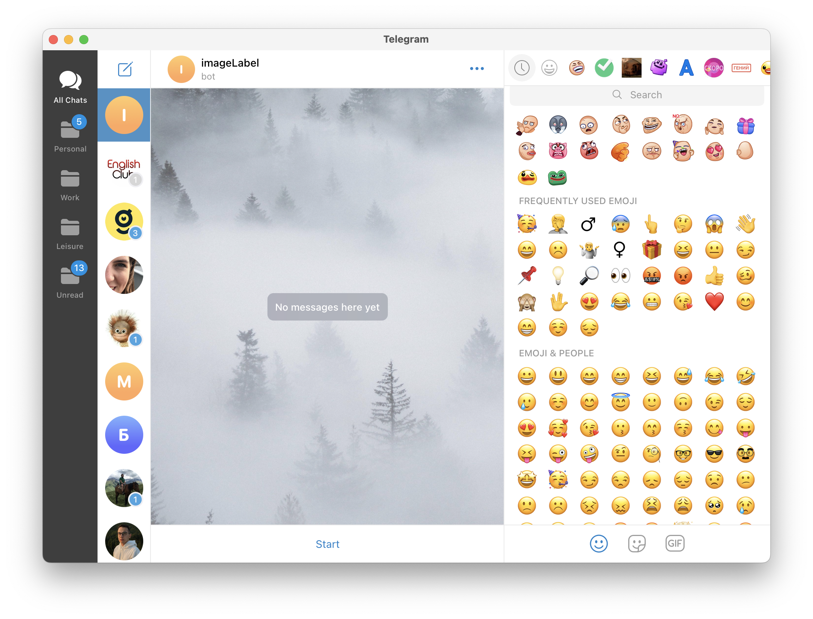
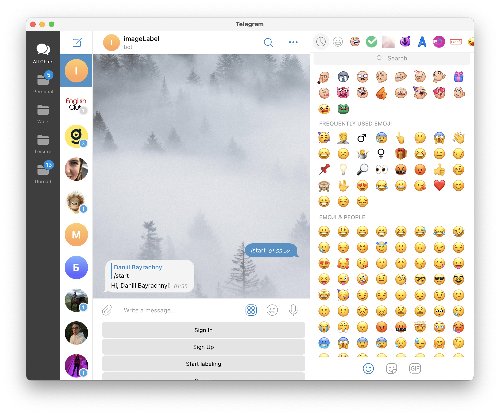
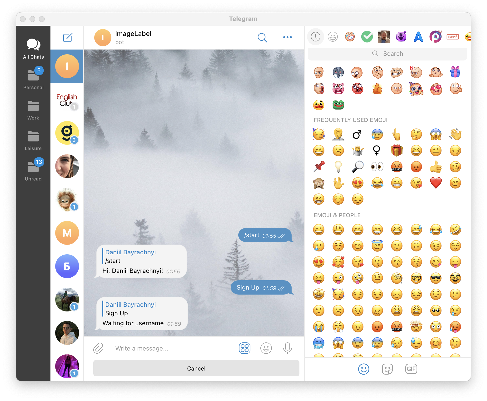
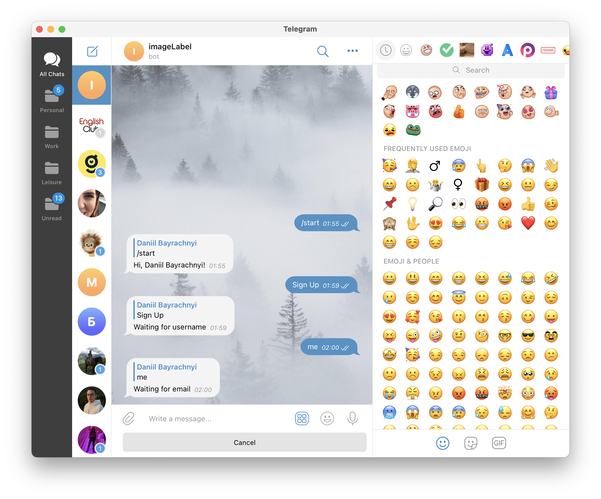
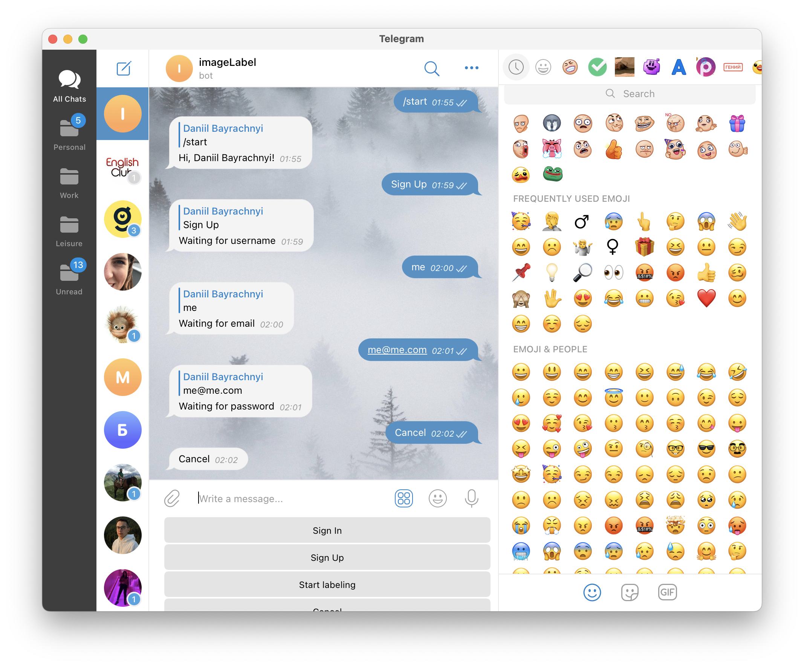
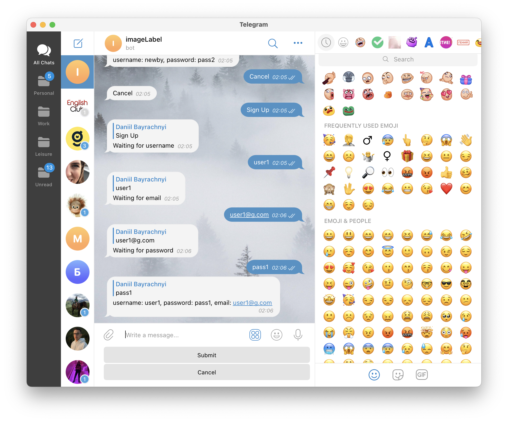
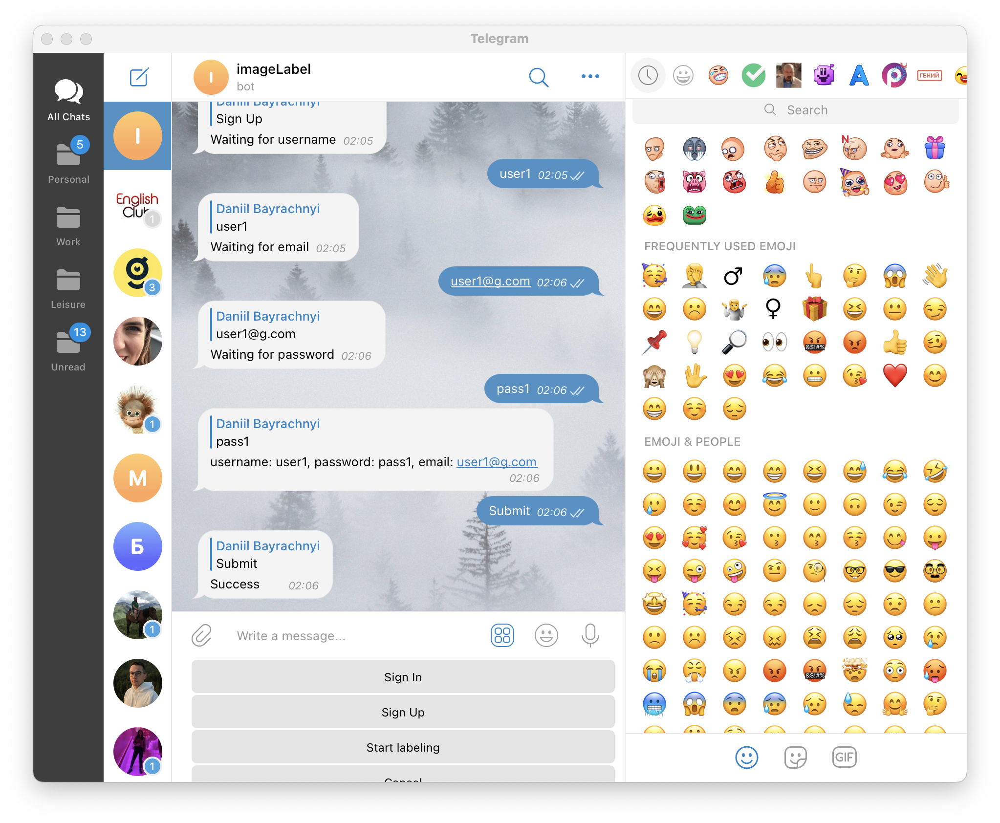
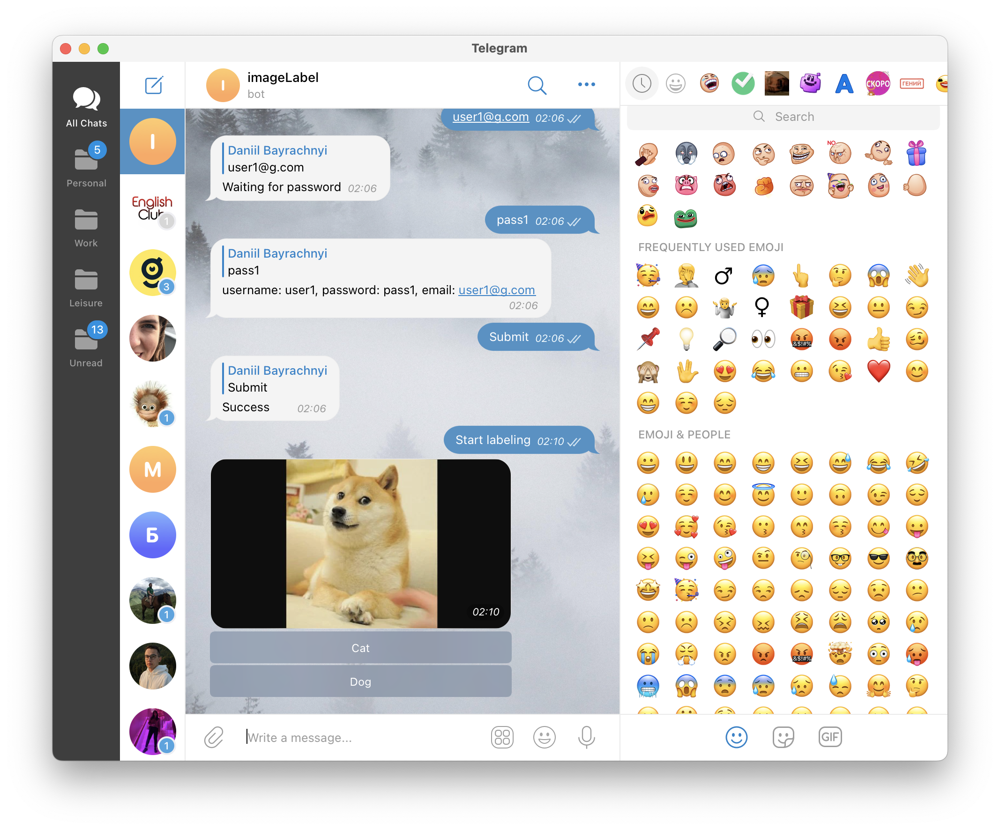
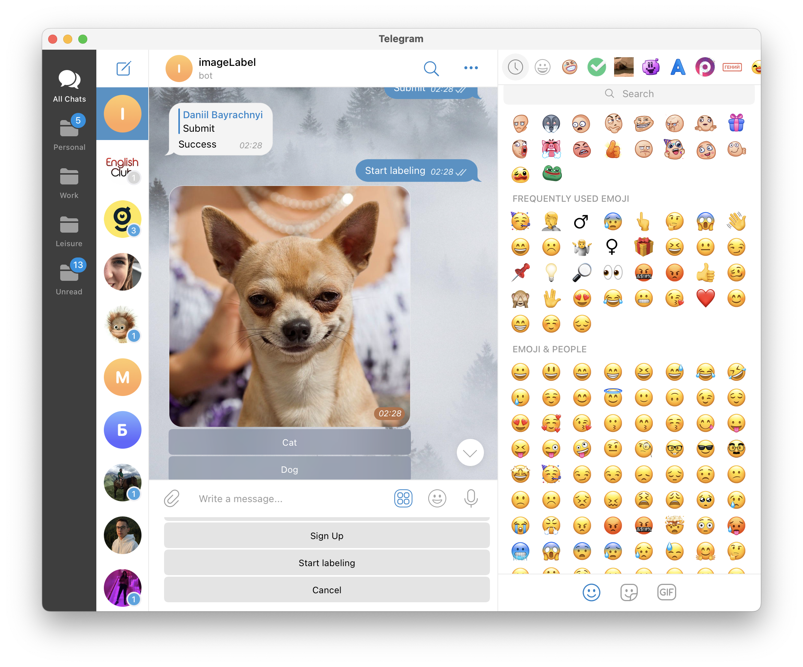
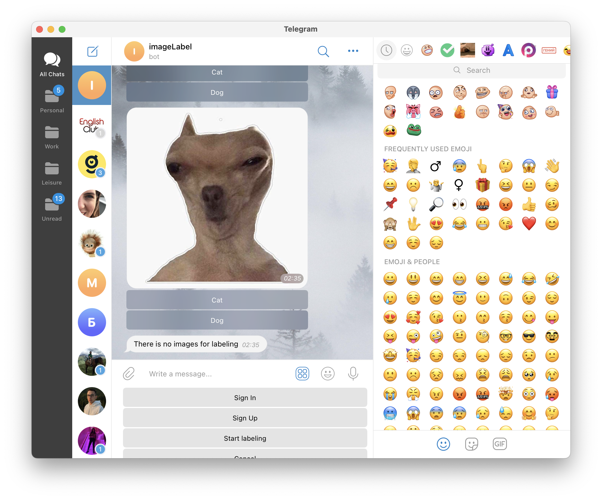

# Image Clustering

MVP of markup(labeling) tool through a telegram bot

##Links
<br>[GitHub](https://github.com/bdannyv/markup_tool.git)
<br>[DockerHub Admin Panel](https://hub.docker.com/repository/docker/bdavl/image-clustering-admin-panel)
<br>[DockerHub Bot](https://hub.docker.com/repository/docker/bdavl/image-clustering-telegram-bot)
<br>[Telegram bot](https://t.me/imageLabelBot)

## How to?
###Start project

1. Set environment variables according to .env-example
   1. .env attached to the project  
   2. contacts for .env: [Daniil Bairachnyi](https://t.me/ssommebboddy)
2. Build containers
```shell
docker-compose up -d
 ```

###Admin flow
1. Create a superuser first
```shell
docker exec -it {NAME OF YOUR DIRECTORY}-admin-panel-1 bash
```

```shell
python manage.py createsuperuser
# follow instructions
```
2. Become a content manager
   1. [Upload](http://localhost:8000/admin/image_markup/imagetable/) images via admin panel
   2. [Add image](http://localhost:8000/admin/image_markup/imageclass/) classes (IMAGE_MARKUP -> Images)
   3. You can check statistics. Check link below apps list or [visit link](http://localhost:8000/markup/v1/statistics/)

### [Telegram bot](https://t.me/imageLabelBot)

1. Click "Start". Now you are able to use 4 buttons
   1. Sign In
   2. Sign Up
   3. Start labeling
   4. Cancel

2. You cant start labeling if you are not authenticated. So sign first <br>or sign up if you use this bot for the first time

3. Now bot are waiting for your username, email and password

4. If you had been misspelled something you can use "Cancel" on bot keyboard

5. If everything is ok bot will ask you to submit

6. After submitting you will receive a status

7. "Sign In" flow is almost the same excluding email step
8. After authentication, you can start make image markup by clicking "Start Labeling"

9. List of available classes under the image is combined from database (Admin flow 2.2)
10. If you got bored. You can exit by clicking "Cancel" on keyboard

11. After you finished you will see the following message

